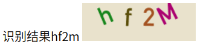

# ImageOCR

> php 验证码识别库，对于非粘连字符具有很好的识别效果，对于一般粘连字符也能有较为良好的识别
> 除噪算法支持孤立点除杂和连通域除噪，分割算法支持等宽分割、连通域分割以及滴水算法分割

## 示例效果



## Install

```
composer require mohuishou/image-ocr
```

## 使用方法

例子详见 [example](./example)

### use docker

```bash
docker run --rm -p 8088:8088 mohuishou/image-ocr
```

点击 http://localhost:8088 查看效果

### 大致流程：

```
初始化 -> 灰度化 ---> 二值化 ---> 除噪点 -> 分割 -> 标准化 -> 识别
```

#### 初始化

对象初始化

```php
$image=new Image($img_path);
$image_ocr=new ImageOCR($image)
```

初始化二值化阈值

```php
$image_ocr->setMaxGrey(90);
$image_ocr->setMinGrey(10);
```

初始化标准化图片宽高

```php
$image_ocr->setStandardWidth(13);
$image_ocr->setStandardHeight(20);
```

#### 开启 Debug

```php
$image_ocr->setDebug(true);
```

#### 灰度化

```php
try{
    $image_ocr->grey();
}catch (\Exception $e){
    echo $e->getMessage();
}
```

#### 二值化

注意：这一步的前提是需要先执行上一步灰度化，不然会抛出一个错误

```php
try{
    $image_ocr->hash($max_grey=null,$min_grey=null);
}catch (\Exception $e){
    echo $e->getMessage();
}
```

二值化支持两种方式，第一种`$image_ocr->hash($max_grey=null,$min_grey=null)`即为上面那种固定的阈值范围，第二种为`hashByBackground($model=self::MAX_MODEL,$max_grey=null,$min_grey=null)`，通过背景图像的灰度值，动态取阈值，支持三种模式`MAX_MODEL`,`MIN_MODEL`,`BG_MODEL`分别是最大值、最小值和背景模式，最大值模式会用背景的灰度值替换阈值的上限，最小值模式替换下限，背景模式上下限都替换，即为只去除背景

#### 除噪点

前置条件为二值化

##### 孤立点除噪法

```php
try{
    $image_ocr->removeSpots();
}catch (\Exception $e){
    echo $e->getMessage();
}
```

##### 连通域除噪法

_[如果要使用连通域分割法，可以跳过连通域除噪点，分割的同时可以一并除噪]_

```php
try{
    //使用之前需要初始化连通域对象
    $image_ocr->setImageConnect();
    //除噪
    $image_ocr->removeSpotsByConnect();
}catch (\Exception $e){
    echo $e->getMessage();
}
```

#### 分割

##### 非粘连字符串

连通域分割法

```php
try{
    //使用之前需要初始化连通域对象
    $image_ocr->setImageConnect();
    //分割
    $image_ocr->splitByConnect();
}catch (\Exception $e){
    echo $e->getMessage();
}
```

##### 粘连字符串

滴水算法分割

TODO: 待测试

#### 标准化

```php
try{
    $standard_data=$image_ocr->standard();
}catch (\Exception $e){
    echo $e->getMessage();
}
```

#### 识别

TODO:待完善

## API

```php
ImageOCR::__construct(Image $image)
ImageOCR::saveImage($path)
ImageOCR::grey()
ImageOCR::hash($max_grey=null,$min_grey=null)
ImageOCR::hashByBackground($model=self::MAX_MODEL,$max_grey=null,$min_grey=null)
ImageOCR::removeSpots()
ImageOCR::removeSpotsByConnect()
ImageOCR::standard()
ImageOCR::setImageConnect()
ImageOCR::setImage(Image $image)
ImageOCR::getStandardData()
ImageOCR::setMaxGrey($max_grey)
ImageOCR::setMinGrey($min_grey)
ImageOCR::setStandardWidth($standard_width)
ImageOCR::setStandardHeight($standard_height)

//ImageTool的方法均为静态方法
ImageTool::removeZero($data)
ImageTool::removeZeroColumn($hash_data)
ImageTool::drawBrowser($data)
ImageTool::transposeAndRemoveZero($hash_data)
ImageTool::hashTranspose($hash_data)
ImageTool::img2hash($img)
ImageTool::hash2img($hash_data,$padding=0)
```

## CHANGELOG

### 0.2 [2017-4-1]

### 0.1 [2016-10-7]

1. 默认模板保存方式由数据库改为文件，保存路径为./db/db.json
2. 使用 composer 安装
